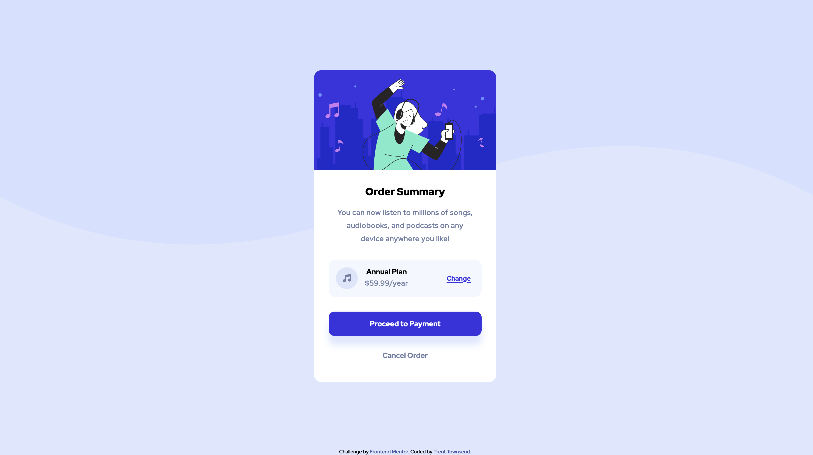

# Order summary card solution

This is a solution to the [Order summary card challenge on Frontend Mentor](https://www.frontendmentor.io/challenges/order-summary-component-QlPmajDUj). Frontend Mentor challenges help you improve your coding skills by building realistic projects. 

## Table of contents

- [Overview](#overview)
  - [The challenge](#the-challenge)
  - [Screenshot](#screenshot)
  - [Links](#links)
- [My process](#my-process)
  - [Built with](#built-with)
- [Author](#author)

## Overview

### The challenge

Users should be able to:
- Replicate the a order summary component using a mobile first approach
- See hover states for interactive elements

### Screenshot

#### Mobile layout

#### Desktop layout

### Links

- Live Site URL: https://trent-townsend.github.io/order-summary-component/
- Solution URL: 
  - [HTML](https://github.com/trent-townsend/order-summary-component/blob/main/index.html)
  - [CSS](https://github.com/trent-townsend/order-summary-component/blob/main/styles.css)

## My process
### Built with
- Semantic HTML5 markup
- CSS custom properties
- Flexbox
- Mobile first approach
- Accessibility in mind
- Media queries

## Author
- Website - [Trent Townsend](https://www.trenttownsend.com)
- Twitter - [@trent-townsend](https://www.twitter.com/trent_townsend)
